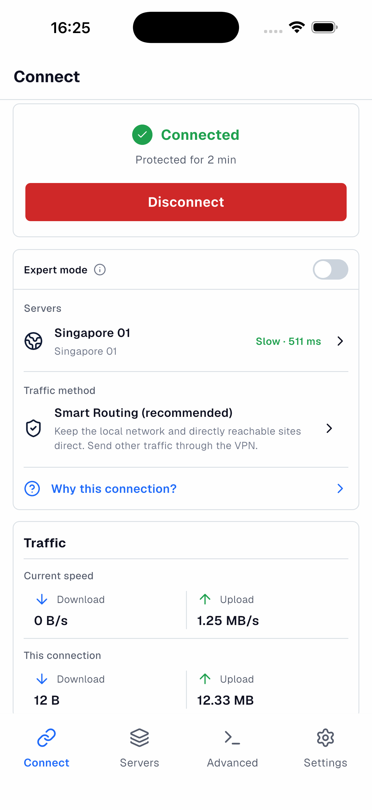
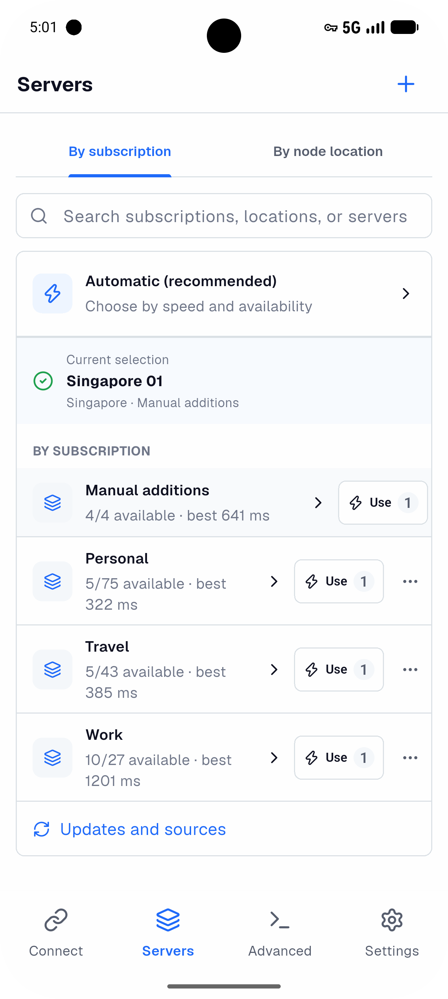
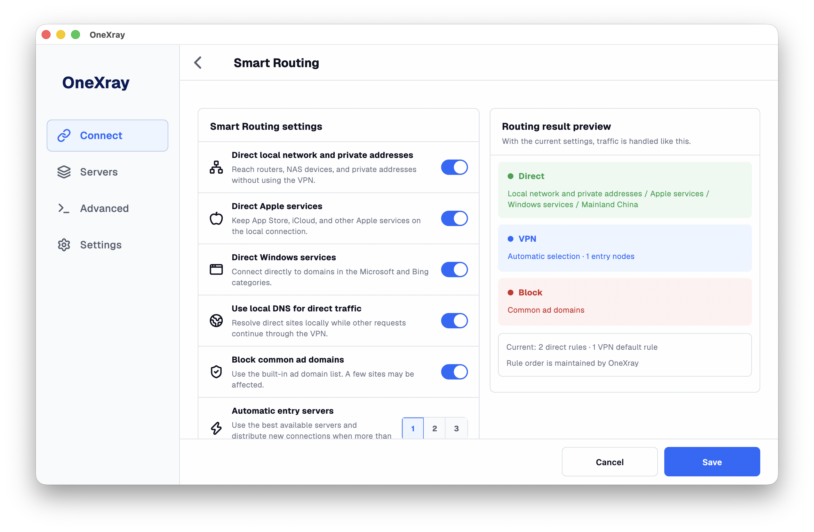
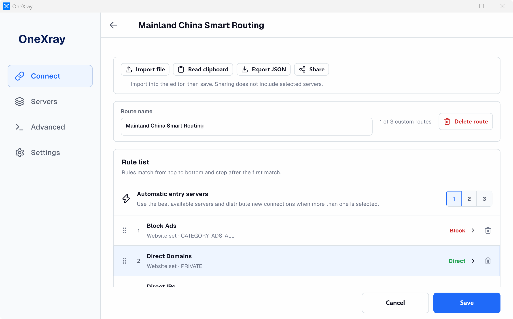

<p align="center">
  
</p>

<h1 align="center">OneXray</h1>

<p align="center">
  Your servers. Your routing. On every device.
</p>

<p align="center">
  <a href="https://github.com/OneXray/OneXray/releases/latest"></a>
  <a href="./LICENSE"></a>
  
</p>

<p align="center">
  <a href="https://onexray.com">Documentation</a> ·
  <a href="https://github.com/OneXray/OneXray/releases">Releases</a> ·
  <a href="https://t.me/OneXrayApp">Telegram</a>
</p>

<p align="center">
  English · <a href="./readme/README.zh_CN.md">简体中文</a> · <a href="./readme/README.ru.md">Русский</a>
</p>

OneXray is an open-source Xray-core client for phones, tablets, and desktops. Import your servers or subscriptions, choose how traffic is routed, and connect through your device's system VPN.

**Bring your own servers.** OneXray does not provide VPN access, proxy servers, or subscriptions. A compatible configuration or subscription from a provider you trust is required.

## Download

| Platform | Requirements | Download |
| --- | --- | --- |
| iPhone / iPad | iOS / iPadOS 15+ | [App Store](https://apps.apple.com/us/app/onexray/id6745748773) · [IPA](https://github.com/OneXray/OneXray/releases/latest/download/OneXray-ios.ipa) |
| macOS | macOS 13+, Apple silicon or Intel | [Mac App Store](https://apps.apple.com/us/app/onexray/id6745748773) |
| macOS — OneXraySE | macOS 13+, Apple silicon or Intel | [Homebrew](https://formulae.brew.sh/cask/onexrayse) · [Universal ZIP](https://github.com/OneXray/OneXray/releases/latest/download/OneXray-macos-universal.zip) |
| Android phones / tablets | Android 10+, arm64-v8a or x86_64 | [Google Play](https://play.google.com/store/apps/details?id=net.yuandev.onexray) · [Universal APK](https://github.com/OneXray/OneXray/releases/latest/download/OneXray-android-universal.apk) |
| Windows x64 | Windows 10 20H2+ | `winget install --id YuanDevLLC.OneXray -e` · [ZIP](https://github.com/OneXray/OneXray/releases/latest/download/OneXray-windows-amd64.zip) · [Microsoft Store](https://apps.microsoft.com/detail/9NJ0MVHW215D) |
| Windows ARM64 | Windows 11 | `winget install --id YuanDevLLC.OneXray -e` · [ZIP](https://github.com/OneXray/OneXray/releases/latest/download/OneXray-windows-arm64.zip) · [Microsoft Store](https://apps.microsoft.com/detail/9NJ0MVHW215D) |
| Linux x86_64 | glibc 2.39+ | [DEB](https://github.com/OneXray/OneXray/releases/latest/download/OneXray-linux-x86_64.deb) · [ZIP](https://github.com/OneXray/OneXray/releases/latest/download/OneXray-linux-x86_64.zip) |
| Linux arm64 | glibc 2.39+ | [DEB](https://github.com/OneXray/OneXray/releases/latest/download/OneXray-linux-aarch64.deb) · [ZIP](https://github.com/OneXray/OneXray/releases/latest/download/OneXray-linux-aarch64.zip) |

This README describes the current codebase. Store and release builds may differ. See the [installation notes](#installation-notes) for platform-specific requirements.

## What you can do

- **Connect your way.** Use automatic selection, a subscription, a location, or a specific server. See connection status, live upload/download speeds, and traffic for the current connection.
- **Keep servers organized.** Browse by subscription or node location, compare latency and protocol labels, and edit, share, or delete servers and subscriptions. Import share links and Xray JSON nodes from text or files; scan QR codes on iOS and Android.
- **Start with Smart Routing.** Choose a direct region, keep local networks and selected services direct, and optionally block common ad domains. Select 1–3 entry servers for automatic selection and load balancing, with an optional final exit for chained connections.
- **Write your own rules.** Custom Routing provides ordered domain, IP, port, and network conditions with direct, VPN, or block actions. Domain and IP inputs offer GeoData completion. Import, export, and share routes independently of your selected servers.
- **Use complete configurations.** Expert mode replaces the normal server selector with a Raw JSON configuration selector and editor. OneXray still manages the tunnel, logging, metrics, and related runtime settings; see the [configuration contract](./docs/xray-configuration.md) (Chinese).
- **Maintain your setup.** Refresh subscriptions and GeoData manually or on a schedule, configure latency-test URLs and timeouts, and inspect the generated Xray configuration. Local access/error logs are available except in the macOS System Extension build.

Subscriptions can use **age encryption** with an existing key pair or locally generated X25519 / Hybrid (`ML-KEM-768 + X25519`) keys. Only the public key is sent to the subscription source; the private key stays on your device. HTTPS is required. [Age subscription details](./docs/age-encrypted-subscriptions.md) (Chinese).

## Screenshots

Real running screenshots from iOS, Android, macOS, and Windows. Click an image to view it at full size.

<table>
  <tr>
    <th width="50%">iOS · Connect</th>
    <th width="50%">Android · Servers</th>
  </tr>
  <tr>
    <td align="center"><a href="./readme/images/connect-ios.png"></a></td>
    <td align="center"><a href="./readme/images/servers-android.png"></a></td>
  </tr>
</table>

### macOS · Smart Routing



### Windows · Custom Routing



## First connection

1. Complete the initial setup and grant the requested system permissions. Windows and Linux also require an explicit Xray outbound-interface selection.
2. Choose a country or region for Smart Routing's direct region, and import your servers or subscription. Both steps can be skipped; you can finish them later.
3. On **Connect**, select your servers and traffic method, then start the VPN. Smart Routing is a useful starting point; **All via VPN** sends traffic through your selected server, while **Custom Routing** uses your own rules.

Server imports extract nodes, not the source file's routing or DNS configuration. Import complete configurations through Custom Routing or Raw JSON instead.

## Platform features

| Platform | Integration |
| --- | --- |
| iOS / macOS | Always-on and on-demand VPN; connect or disconnect on selected Wi-Fi networks; separate cellular (iOS) or Ethernet (macOS) behavior. |
| Android | Per-app VPN: all apps, only selected apps, or all except selected apps. Inclusion and exclusion lists are saved separately. |
| Windows / Linux | Explicit Xray outbound-interface selection. |
| Desktop | Tray controls, launch at login, start hidden, and optional connection when the app opens. |

Light and dark themes and the interface language follow the system by default. Available languages: English, Simplified Chinese, Traditional Chinese, Russian, and Persian, including right-to-left layout for Persian.

## Installation notes

<details>
<summary>macOS: Mac App Store or OneXraySE</summary>

The Mac App Store build uses a Packet Tunnel extension. The separately distributed **OneXraySE** uses a System Extension and is available through [Homebrew](https://formulae.brew.sh/cask/onexrayse):

```shell
brew install --cask onexrayse
```

For the ZIP build, extract it and move `OneXraySE.app` to `/Applications` before opening it. Complete the initial setup and approve the VPN and Network Extension requests. Depending on the macOS version, approval may appear in **System Settings → General → Login Items & Extensions** or **Privacy & Security**. Follow any restart prompt. See [Apple's System Extension installation guide](https://developer.apple.com/documentation/systemextensions/installing-system-extensions-and-drivers).

To update the ZIP build, quit OneXraySE, replace the app in `/Applications`, and reopen it. Approve an extension update if requested.

</details>

<details>
<summary>iOS: installing an IPA</summary>

The App Store is the simplest installation route. An IPA must be re-signed together with its Packet Tunnel extension using provisioning profiles that allow Network Extension capabilities. A free Personal Team cannot provide the required capability; a paid Apple Developer Program membership is required. An app that opens successfully is not proof that its VPN extension is authorized. See [Apple's supported capabilities](https://developer.apple.com/help/account/reference/supported-capabilities-ios/).

</details>

<details>
<summary>Windows: EXE / ZIP and Microsoft Store</summary>

EXE and ZIP use a standalone Core with a native TUN interface; starting VPN requests administrator approval through UAC. Extract the entire ZIP before running it: a ZIP does not register protocol links or create shortcuts automatically.

[Microsoft Store](https://apps.microsoft.com/detail/9NJ0MVHW215D) uses an MSIX package with a system VPN provider and handles architecture selection and updates. EXE / ZIP and MSIX use separate data locations and are not interchangeable upgrade channels. See the [Windows build guide](docs/windows-build.md) for development builds and mode selection.

</details>

<details>
<summary>Linux: packages and permissions</summary>

On Debian/Ubuntu, install the DEB matching your architecture. It installs the runtime dependencies, registers OneXray links, and grants the required network capabilities:

```shell
sudo apt install ./OneXray-linux-x86_64.deb
```

For arm64, use `OneXray-linux-aarch64.deb` instead. For the ZIP build on Debian/Ubuntu, run the following from the directory containing the extracted `OneXray` folder:

```shell
sudo apt install -y procps libcap2-bin libayatana-appindicator3-1
sudo setcap cap_net_admin,cap_net_raw+eip OneXray/OneXrayCore
```

ZIP builds do not register `onexray://` links automatically. GNOME users may need the [AppIndicator extension](https://github.com/ubuntu/gnome-shell-extension-appindicator) for tray controls.

</details>

## Privacy

No account, advertising, analytics, tracking, telemetry, or crash reporting. OneXray does not collect your traffic, browsing history, configurations, or connection logs. Your configuration determines which servers and services receive network requests. Subscription sources, DNS servers, and other third-party services have their own privacy policies. [Privacy policy](https://onexray.com/docs/privacy/).

Shared configurations, subscription URLs, and exported logs may contain credentials or other sensitive data. Review their contents before sharing.

## Documentation and contributing

- [User documentation](https://onexray.com) and [Telegram community](https://t.me/OneXrayApp).
- [Development setup](./readme/FIRST_RUN.md) for local debugging; [build scripts](./build_scripts/README.md) for packaging.
- [Current App contracts](./docs/README.md) (Chinese), including [imports and OneXray links](./docs/subscriptions-and-sharing.md).
- [Report a bug or request a feature](https://github.com/OneXray/OneXray/issues). Include the platform, App/Xray-core versions, and steps to reproduce; do not publish private credentials.

Code, translations, and [documentation improvements](https://github.com/OneXray/onexray.com) are welcome.

## License

[GNU General Public License v3.0](./LICENSE).
